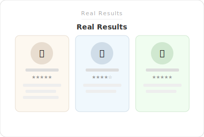

# SL - Real Results




Product highlights as a **card stack** (Swiper cards effect). Data comes from a product metafield. Each card shows an icon + title; cards with a description open a modal on click.

**Category:** Content  
**Metafield:** `custom.real_results_highlights` (list of Product Highlight metaobjects)

---

## Features

- **Swiper cards effect** — stacked cards, swipe/arrows to navigate
- **Per-product highlights** via metafield
- **Icon + title** per card (optional description and image in modal)
- **Modal** for highlights that have a description
- **RTL** support (Arabic, Hebrew, Farsi)
- Modern, minimal styling

---

## Setup

### Step 1 — Product Highlight metaobject

1. **Settings** → **Custom data** → **Metaobjects** → **Add definition**
2. **Name:** `Product Highlight`
3. Add fields:
   - **Title** (Single line text) — required
   - **Description** (Multi-line text) — optional; if set, clicking the card opens a modal
   - **Icon** (File — Image) — optional; small image (e.g. 24×24). If blank, a default star icon is used
   - **Image** (File — Image) — optional; shown in the modal
4. Save

### Step 2 — Product metafield

1. **Settings** → **Custom data** → **Products** → **Add definition**
2. **Name:** `Real results highlights`
3. **Namespace and key:** `custom.real_results_highlights`
4. **Type:** List of metaobject references → **Product Highlight**
5. **Storefront access:** enabled
6. Save

### Step 3 — Assign highlights to products

1. **Products** → open a product
2. **Metafields** → **Real results highlights**
3. Add Product Highlight entries (create metaobjects with title, optional description, icon, image)
4. Save

### Step 4 — Add to product template

**Option A — Section**

1. **Online Store** → **Themes** → **Customize**
2. Product page → Add section **SL - Real Results**
3. Configure heading, colors, padding
4. Save

**Option B — Snippet** (Custom Liquid block)

1. Add **Custom Liquid** block in product info
2. Paste: ``
3. Save

---

## File structure

```
Section Lab/Real Results/
├── sections/
│   └── sl-real-results.liquid
├── snippets/
│   └── sl-real-results.liquid
├── locales/
│   ├── en.default.json
│   └── ar.json
└── README.md
```

---

## Localization

Translation keys (add to theme root `locales/en.default.json` and `locales/ar.json` if not using the Section Lab locale files):

- `sections.sl_real_results.heading` — section heading (e.g. "Real Results")
- `sections.sl_real_results.no_highlights` — message when no highlights (design mode)
- `sections.sl_real_results.close` — modal close button label

---

## Metaobject field names

The section expects the Product Highlight metaobject to have:

- **title** (or **headline**) — single line
- **description** — multi-line (optional)
- **icon** — image file (optional)
- **image** — image file for modal (optional)

If your metaobject uses different keys, adjust the Liquid in the section/snippet (e.g. `entry.headline` is used as fallback for `entry.title`).
