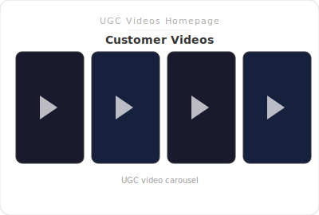

# SL - UGC Videos Homepage




Home page section: a **Swiper** of UGC-style video cards, each with a **related product** strip below. Clicking a card opens a **full-screen overlay** with the video (autoplay, controls) and the same product CTA (“Get the product”).

**Related:** [SL - UGC Videos Carousel](../UGC%20Videos%20Carousel/README.md) is the same concept usable on any template (not limited to the home page).

**Category:** Media  
**Templates:** Home page (`index` only)

---

## Features

- **Blocks:** Each block = one video + one related product (rating/review count optional).
- **Card layout:** Portrait video (9:16) + product row (image, name, 5-star graphic, price, compare-at, CTA button).
- **Overlay on click:** Full video with controls, product info, and “Get the product” link. Close via button or clicking outside. Escape key closes overlay.
- **Swiper:** Horizontal slider with prev/next arrows; configurable slides per view and gap.
- **RTL:** Supported for Arabic and similar locales.
- **First video** autoplays muted in the slider; overlay video autoplays with sound when opened.

---

## Setup

1. **Theme Editor** → Home page → **Add section** → **SL - UGC Videos Homepage**.
2. Set **Heading** (e.g. “Real Products. In Real Life”) and optional subheading.
3. Add **Video + product** blocks — pick a video and a related product for each.
4. Adjust slider (slides per view, gap), card styling (radius, colors), CTA text and colors, and section padding/width.

---

## Overlay

- **Close:** White circular close button (top-right; top-left in RTL), or click the dark backdrop, or press Escape.
- **Video:** Uses the same file as the card; plays with controls in the overlay.
- **Product block:** Product image, title, star graphic, price, compare-at price (if any), and “Get the product” link.

---

## File structure

```
Section Lab/UGC Videos Homepage/
├── sections/
│   └── sl-ugc-videos-homepage.liquid
├── locales/
│   ├── en.default.json
│   └── ar.json
└── README.md
```

---

## Translations

- `sections.sl_ugc_hp.close_video` — Close button label (accessibility).
- `sections.sl_ugc_hp.loading` — Shown while the overlay video loads.

Merge these into your theme’s `locales/en.default.json` and `locales/ar.json` (or add to theme root locale files) if you don’t use the Section Lab locale files.
